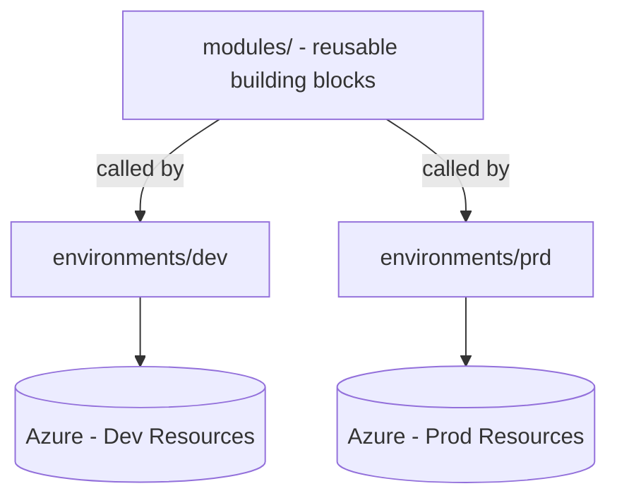
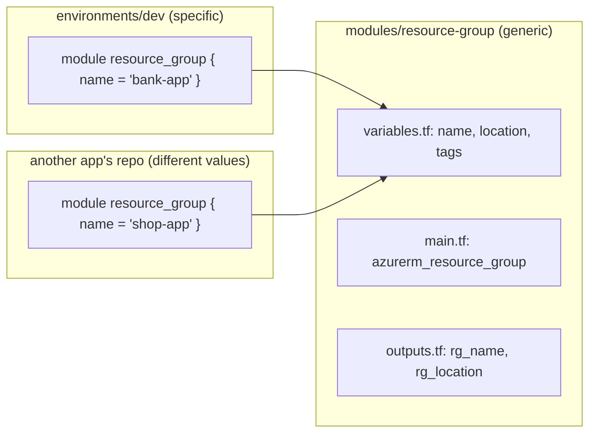
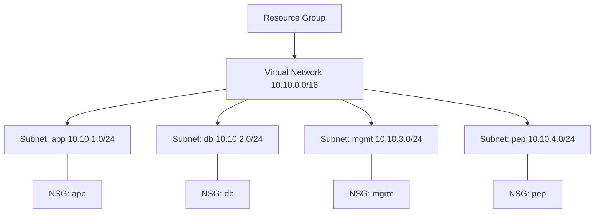

# Terraform + Azure — Zero to Hero Journey

This document is a running record of everything learned so far while building a production-style Terraform setup on Azure. It's written in simple English, with diagrams, so it can double as **interview prep** and as **onboarding documentation** for anyone else who joins this project.

---

## 1. The Big Picture — What We're Building

We are building infrastructure using **Terraform** (an Infrastructure as Code tool) on **Azure**, following a pattern used by real engineering teams:

- **Reusable modules** — small, generic building blocks (Resource Group, Networking, NSG, etc.)
- **Environments** — separate folders (`dev`, `prd`) that call those modules with their own values
- **Remote state** — Terraform's memory of what exists, stored safely in Azure, not on a laptop



Later, this `modules/` folder can be split into its **own Git repository**, versioned with tags, so completely different application repos can call the same modules — just like installing a library.

---

## 2. Core Terraform Concepts

| Term | Simple Meaning |
|---|---|
| **Provider** | The plugin that lets Terraform talk to Azure (`azurerm`) |
| **Resource** | One real thing created in Azure — a VNet, a Subnet, an NSG |
| **Module** | A reusable folder of `.tf` files that builds one or more resources, with inputs and outputs — like a function |
| **Variable** | An input into a module or root config — like a function parameter. Its value can come from outside (a `.tfvars` file, CLI, environment variable) |
| **Local** | A named value computed/fixed **inside** a file — not an external input, just avoids repeating the same expression many times |
| **Output** | A value a module hands back to whoever called it — like a function's return value |
| **State** | Terraform's memory file (`terraform.tfstate`) of what it has created. Must be stored remotely and safely in production |
| **Backend** | Where the state file physically lives (e.g., an Azure Storage Account) |

### Variable vs Local — the real rule

Don't think of this as "temporary vs permanent." Think of it as: **who needs to control this value?**

| Use `variable` when... | Use `local` when... |
|---|---|
| The value legitimately differs between environments (dev vs prd) — e.g. `subscription_id`, `location`, `tags` | The value is a fixed design decision, same for every environment — e.g. a naming convention like `"bank-app"` |
| Someone outside this file needs to set it (`.tfvars`, CI/CD pipeline) | You just want ONE source of truth used in multiple places within the same file, to avoid drift/typos |

**Real bug we hit:** we once referenced `var.snet_app_name` in one module call and a hardcoded string in another. Because they weren't the same source of truth, the names drifted apart silently. Moving the value into a single `local` and referencing `local.snet_app_name` everywhere fixed it permanently — this is the core reason `locals` exist.

---

## 3. Repository Structure

```
Terraform/
├── environments/
│   ├── dev/
│   │   ├── backend.tf        # Where THIS environment's state is stored
│   │   ├── main.tf           # Calls modules, passes values
│   │   ├── variables.tf      # Inputs this environment needs
│   │   ├── terraform.tfvars   # Actual values for dev
│   │   ├── providers.tf       # Provider (azurerm) configuration
│   │   └── versions.tf        # Required Terraform & provider versions
│   └── prd/                  # Same structure, different values, own state file
├── modules/
│   ├── resource-group/
│   ├── networking/
│   ├── nsg/
│   ├── key-vault/
│   ├── app_service/
│   └── monitoring/
├── .gitignore
└── LICENSE
```

**Key rule:** Modules never contain a `provider {}` block. Only the root (`environments/dev`) configures the provider — this is what makes a module portable and reusable by anyone.

---

## 4. Remote State — Why and How

### Why not just use local state?

If `terraform.tfstate` lives only on your laptop:
- Nobody else can safely run Terraform on the same infrastructure
- If your laptop is lost, the record of "what exists" is lost
- No locking — two people running `apply` at once can corrupt infrastructure

### The fix: remote backend in Azure

We create a **dedicated Storage Account** (outside the main project, done once, manually) to hold state files:

```powershell
az group create --name rg-terraform-state --location eastus

az storage account create \
  --resource-group rg-terraform-state \
  --name tfstateprodacc001 \
  --sku Standard_LRS \
  --min-tls-version TLS1_2 \
  --allow-blob-public-access false

az storage container create \
  --name tfstate \
  --account-name tfstateprodacc001
```

Then point Terraform at it:

```hcl
# environments/dev/backend.tf
terraform {
  backend "azurerm" {
    resource_group_name  = "ci-app-tfstate-rg"
    storage_account_name = "tfstateci"
    container_name        = "tfstate"
    key                    = "dev.tfstate"   # different key per environment!
  }
}
```

Each environment (`dev`, `prd`) uses a **different `key`**, so their state files never collide. Azure Blob Storage also provides automatic **state locking** — Terraform takes a lease on the blob while running, so two people can't `apply` at the same time.

### Production rules for state
- Never commit `*.tfstate` or `.terraform/` to Git — state can contain secrets in plain text
- Enable **versioning** on the storage account, so a bad state can be rolled back
- Restrict network access to the state storage account

---

## 5. The Module Pattern (Reusability)

### The idea

A module is like a library function. It doesn't know or care which application is calling it — it just takes inputs and builds resources.



### Calling a module — two ways

**Local path (mono-repo — what we use today):**
```hcl
module "resource_group" {
  source = "../../modules/resource-group"
  name   = "ci-customer-dashboard"
}
```

**Git source with version tag (multi-repo — for when modules move to their own repo):**
```hcl
module "resource_group" {
  source = "git::https://github.com/yourorg/terraform-azure-modules.git//modules/resource-group?ref=v1.0.0"
  name   = "ci-customer-dashboard"
}
```
The `?ref=v1.0.0` pins a specific version, so upgrading a module never silently breaks other teams using it. This is done with Git **tags**.

---

## 6. Networking Module — What We Built



- **VNet** = the private network boundary in Azure
- **Subnet** = a smaller network segment inside the VNet, used to separate different tiers (app, database, management, private endpoints)
- **NSG (Network Security Group)** = a firewall attached to a subnet, controlling what traffic is allowed in/out

Every value that could change (VNet name, CIDR ranges, subnet names) is passed in as a **variable**, not hardcoded inside the module — this is what makes the module reusable for other applications with different naming/IP ranges.

---

## 7. Loops in Terraform — `for_each`

### Why loops matter

Without a loop, 4 nearly-identical subnets means 4 nearly-identical blocks of code — repetitive and error-prone (easy for values to drift apart, exactly the bug we hit earlier).

### `for_each` vs `count`

| `count` | `for_each` |
|---|---|
| Uses a numeric index (0, 1, 2, 3) | Uses a stable key (a name) |
| Removing an item from the middle can confuse Terraform about which resource is which — risk of destroying/recreating the wrong one | Removing one key only affects that one resource — safer |
| Simple for truly identical, unnamed repeats | Preferred in production for anything with meaningful names |

### Example — before and after

**Before (repetitive):**
```hcl
resource "azurerm_subnet" "subnet_app" { name = "app" ... }
resource "azurerm_subnet" "subnet_db"  { name = "db"  ... }
```

**After (`for_each`):**
```hcl
variable "subnets" {
  type = map(object({
    name             = string
    address_prefixes = list(string)
  }))
}

resource "azurerm_subnet" "subnet" {
  for_each             = var.subnets
  name                 = "ic-${each.value.name}-${var.environment}"
  address_prefixes     = each.value.address_prefixes
  virtual_network_name = azurerm_virtual_network.vnet.name
  resource_group_name  = azurerm_virtual_network.vnet.resource_group_name
}
```

Inside a `for_each` block:
- `each.key` → the map key itself (a plain string, e.g. `"app"`)
- `each.value` → the full object for that key (e.g. `{ name = "app", address_prefixes = [...] }`)

**Common mistake we made:** writing `each.key.subnet_key` — this fails because `each.key` is just a string and has no attributes. The fix was `each.value.subnet_key`.

---

## 8. ⚠️ The Most Important Lesson: Changing a Resource's Address is Dangerous

### What happened

We refactored 4 separate `azurerm_subnet` blocks into one `for_each` block. This changed each resource's **address** in Terraform's eyes:

- Old: `module.networking.azurerm_subnet.subnet_app`
- New: `module.networking.azurerm_subnet.subnet["app"]`

Even though both point to the *same real Azure subnet*, Terraform's state file only knows addresses, not intent. It saw:
- Old address in state, missing from new code → **plans to destroy**
- New address in new code, missing from state → **plans to create**

Because destroy and create had no explicit link, Terraform ran them independently — the destroy succeeded, but the create failed briefly due to Azure's eventual-consistency delay (the old name hadn't fully released yet). Running `apply` again afterward succeeded because by then Azure had caught up.

### The correct, safe way to do this (for next time)

**Option A — `terraform state mv` (manual, one-time fix):**
```powershell
terraform state mv 'module.networking.azurerm_subnet.subnet_app' 'module.networking.azurerm_subnet.subnet["app"]'
```
This tells Terraform "these are the same resource, just update your records" — no destroy, no recreate, zero risk.

**Option B — `moved` blocks (in code, version-controlled, automatic for anyone pulling the repo):**
```hcl
moved {
  from = module.networking.azurerm_subnet.subnet_app
  to   = module.networking.azurerm_subnet.subnet["app"]
}
```
This is the production-grade approach — committed to Git, so the migration happens automatically and safely for every team member, every time.

### 🔑 The golden rule

> **Before running `terraform apply`, always read `terraform plan` carefully.** If you see a resource you didn't intend to touch listed as `destroy` (especially paired with a `create` of something that looks like "the same thing" under a new name) — STOP. Add a `moved` block or run `state mv` first. This exact mistake, on a database or a VM disk instead of a subnet, can mean permanent data loss in a real company.

---

## 9. Common Errors We Hit (and What They Taught Us)

| Error | Root Cause | Fix |
|---|---|---|
| `Required attribute "X" not specified` | Module's `variables.tf` requires an input that the caller (`main.tf`) never passed | Add the missing argument to the module block, or give the variable a `default` |
| `Unsupported attribute ... this object does not have an attribute named "X"` | Referencing an output that doesn't exist, or using `.attribute` on a plain string (like `each.key.something`) | Check the module's `outputs.tf` for the real output name; use `each.value` for objects, `each.key` only as a plain string |
| `a resource with the ID "..." already exists — needs to be imported` | Terraform's state doesn't know about a resource that already exists in Azure — often caused by changing a resource's address without migrating state first | Use `terraform state mv` or a `moved` block |
| NSG created but `security_rule = (known after apply)` shows empty | No custom rules defined — NSG only enforces Azure's default rules (allow within VNet, deny from internet) | Add `azurerm_network_security_rule` resources (ideally via `for_each` over a `security_rules` variable) |

---

## 10. Interview-Style Q&A Recap

**Q: What is Terraform state, and why does it matter?**
A: State is Terraform's record of what infrastructure it has created and manages. It maps your code to real-world resource IDs. Without accurate state, Terraform can't know what to update, and might try to recreate things that already exist.

**Q: Why use a remote backend instead of local state?**
A: Team collaboration (shared source of truth), locking (prevents simultaneous conflicting applies), durability (not lost if one machine is lost), and security (can be access-controlled).

**Q: What's the difference between a variable and a local value?**
A: A variable is an external input — its value can be supplied from outside the file (tfvars, CLI, environment). A local is an internal, computed or fixed value used to avoid repeating an expression within the same configuration — it can't be set from outside.

**Q: What's the difference between `count` and `for_each`?**
A: `count` uses a numeric index, which can cause unwanted resource recreation if items are added/removed from the middle of a list. `for_each` uses stable string keys, so only the specific added/removed key is affected — safer for named, meaningful resources.

**Q: Why should modules not contain a `provider` block?**
A: Provider configuration (auth, subscription, region defaults) is specific to whoever is calling the module, not to the module's logic. Keeping it out of the module keeps the module portable and reusable across different projects/subscriptions.

**Q: What happens if you rename a resource or change how it's declared (e.g., convert to `for_each`)?**
A: Terraform sees it as a different resource address, and will plan to destroy the old one and create a new one — even if the underlying real-world resource is meant to be "the same." This must be handled with `terraform state mv` or a `moved` block to avoid unnecessary/dangerous destroy-and-recreate.

**Q: What is a Network Security Group (NSG), and what does it do by default?**
A: An NSG is a firewall attached to a subnet or network interface in Azure. By default (with no custom rules), it allows traffic within the same VNet and from the Azure Load Balancer, and denies all other inbound traffic from the internet, while allowing general outbound traffic.

**Q: How do you make a Terraform module reusable across multiple applications/repos?**
A: Keep it generic — accept everything environment/app-specific as variables, avoid hardcoding names or provider blocks, publish it to its own Git repo, and use Git tags (`v1.0.0`, etc.) so consumers can pin specific versions via `source = "...?ref=v1.0.0"`.

**Q: Why version/tag your modules?**
A: So consuming applications can upgrade deliberately, instead of automatically inheriting changes (possibly breaking ones) the moment the module's `main` branch changes.

---

## 11. What's Next

- [ ] Define NSG inbound/outbound rules (least-privilege — app, db, mgmt, pep each get only the access they need)
- [ ] Compute layer (VM or App Service, depending on the application)
- [ ] Key Vault for secrets management
- [ ] Modules → separate Git repo + versioning (multi-repo pattern)
- [ ] CI/CD pipeline for Terraform (plan on PR, apply on merge)
- [ ] Monitoring module
- [ ] Full production deployment of a real application
- [ ] Repeat the entire journey on GCP

---

*This README will keep growing as we go — treat it as the single source of truth for this project's Terraform learning journey.*